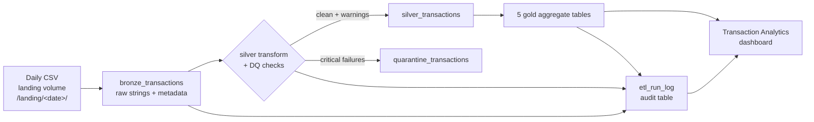

# Daily Transaction ETL on Databricks

A batch ETL pipeline that ingests a daily transaction CSV (~100K rows/day),
applies the assignment's field mapping and data-quality rules, and serves the
results on a Databricks dashboard.

Built and demoed on **Databricks Free Edition** (serverless compute only); the
code is identical on Azure Databricks.

## Architecture

Medallion (Bronze → Silver → Gold) on Delta Lake, orchestrated by a Databricks
Workflows job, deployed as a **Databricks Asset Bundle**: everything in this
repo (notebooks, package, job, dashboard) deploys with one CLI command.



- **Bronze** (`notebooks/01_bronze_ingest.py`): lands the file exactly as
  received, every column a string, so ingestion never fails on bad values.
  Adds `FILE_DATE`, source filename and ingestion timestamp.
- **Silver** (`notebooks/02_silver_transform.py`): applies the full field
  mapping, then splits rows into clean (kept, with warning tags) and
  quarantined (critical failures, kept in a separate table with reasons).
- **Gold** (`notebooks/03_gold_aggregates.py`): small aggregate tables for the
  dashboard: daily summary, country/EU split, customer segments, merchant
  summary, DQ metrics.

All transformation logic lives in a plain, unit-tested Python package
(`src/transaction_etl/`); the notebooks are thin orchestration wrappers. No
Python UDFs: every rule is a native Spark column expression.

## Repository layout

```
├── databricks.yml              # Asset Bundle definition (deploy target, variables)
├── resources/                  # Job + dashboard resource definitions
├── notebooks/                  # 00_setup, 01_bronze, 02_silver, 03_gold
├── src/transaction_etl/        # schema, transforms, quality, audit (unit-tested)
├── tests/                      # pytest suite (runs locally, no cloud needed)
├── dashboards/                 # Lakeview dashboard as code (.lvdash.json)
├── scripts/                    # profile_source.py: profile a file before changing rules
├── data/                       # sample input file (100,001 rows)
└── docs/screenshots/           # dashboard screenshots
```

## Field mapping and assumptions

The mapping from the assignment is implemented in
[`src/transaction_etl/transforms.py`](src/transaction_etl/transforms.py), one
function per rule, one unit test per rule. Where the spec was ambiguous, the
assumption is listed here:

| Field | Assumption |
|---|---|
| `FILE_DATE` | The date folder the file arrives in (`landing/<yyyy-mm-dd>/`), passed as the job's `file_date` parameter; empty parameter = today. The sample file is undated, so the demo run used an explicit date. |
| `CUSTOMER_TYPE` | "age >= 70" is detected via `Age_Band = '>=70'` (no raw age column exists). "gender=unknown" is matched case-insensitively against the literal `unknown`. |
| `POSTING_DATE` | `greatest(posting, transaction)`; if one date fails to parse, the other wins. |
| `TRANSACTION_AMOUNT` | The spec's `transaction_aount` is read as a typo for `transaction_amount`. Cast to `DECIMAL(18,2)`; unparseable → quarantine. The source carries no currency column; amounts are assumed **GBP (£)** (83% of transactions are GBR) and the dashboard labels money axes accordingly. |
| `DESCRIPTION_TEXT` | The trailing token is removed **only** when it equals the row's own `country`; `#####` removed wherever it appears; whitespace collapsed. |
| `EU_FLAG` | The spec's `31-1-2020` is read as 31 January 2020 (Brexit withdrawal date), **inclusive**. Empty/unknown country → `False`. |
| `GENDER_CODE` | Case-insensitive; observed variants `m`, `f`, `mAle` map to M/F; everything else (incl. `Unknown`) → `X`. |
| `POST_CODE` | UK format = structural regex check on the space-stripped, uppercased value (per the spec, no real-postcode lookup). Masked output is the compacted form with the last 2 characters replaced by `**` (`SE23 0AA` → `SE230**`). Non-UK-format values pass through unchanged. |
| `NOTE_TEXT` | Removes all Unicode category-C characters (newlines, tabs, zero-width/format chars). Printable non-Latin text is preserved. |
| Dates | Source format is `dd/MM/yyyy` (verified against all 100K rows). Malformed dates become NULL → quarantine (transaction date) or fallback (posting date). |

## Data quality

Defined in [`src/transaction_etl/quality.py`](src/transaction_etl/quality.py):

- **Critical** (row → quarantine table with reasons): missing/unparseable
  record id, transaction id, transaction date, amount. Nothing is silently
  dropped.
- **Warning** (row kept, tagged in `DQ_WARNINGS`): missing country, invalid
  age band, duplicate transaction id, transaction date after file date.

On the sample file: 100,001 rows in, 0 quarantined; warnings found: 2,222
invalid age bands, 14 missing countries, 2 duplicate transaction ids.

Every stage writes row counts to `etl_run_log` (queryable via SQL for run
history), and quality metrics are charted on the dashboard's
Data Quality & Operations page, so volume anomalies and quality regressions are
visible per run, and the job emails on failure.

## Setup

Prereqs: Python 3.12, Java 17 (local tests only), [Databricks CLI](https://docs.databricks.com/dev-tools/cli/),
a Databricks workspace (Free Edition works).

```bash
# local environment (for unit tests)
py -3.12 -m venv .venv
.venv\Scripts\activate            # Windows; source .venv/bin/activate elsewhere
pip install pyspark==4.0.3 pytest # 4.0.3+: SPARK-53759 breaks 4.0.0/4.0.1 on Windows
pytest -v                         # 12 tests, all local, no cloud needed

# connect to your workspace
databricks auth login --host https://<your-workspace>.cloud.databricks.com
```

In `databricks.yml`, set your workspace `host` and (for the dashboard) your
SQL `warehouse_id` (`databricks warehouses list`).

## Running the pipeline

```bash
# deploy everything: notebooks, package, job, dashboard
databricks bundle deploy

# create the landing area (first time only; also created by the job's setup task)
databricks schemas create transactions workspace
databricks volumes create workspace transactions landing MANAGED

# simulate a daily file arriving
databricks fs mkdir dbfs:/Volumes/workspace/transactions/landing/2026-08-04
databricks fs cp data/inputDataTest.csv dbfs:/Volumes/workspace/transactions/landing/2026-08-04/transactions_2026-08-04.csv

# run
databricks bundle run transaction_etl_daily --params file_date=2026-08-04
```

The job (setup → bronze → silver → gold) has a daily 06:00 UTC schedule,
deliberately **paused** in this demo; unpause for production. Re-running a
`file_date` is idempotent: `replaceWhere` on the partition replaces that day.

The dashboard deploys as a draft named "Transaction Analytics"; open it under
**Dashboards** and publish. Screenshots in [docs/screenshots](docs/screenshots).

Dashboard conventions:
- Insight style and metrics follow Fable Data's published analyses (share of
  spend, monthly YoY comparison, average transaction value, spend per
  customer, weekday patterns, age-band splits), using their brand palette
  (orange #FF6600 accent; the secondary blue is brightened to #4E8FD1 to pass
  contrast checks on dark backgrounds).
- Invalid age bands (`30-30`, `150-59`, `140-49`) are **excluded from the
  analytics charts** but never deleted: they are counted as
  `invalid_age_band` on the Data Quality page. Analytics views show clean
  categories; anomalies stay measurable where they belong.
- All money is displayed as GBP (£) per the documented assumption.

## How the assignment's considerations are addressed

| Consideration | How this solution addresses it |
|---|---|
| **Maintainability** | All rules in one unit-tested package (single place to change, tests catch regressions); source facts as named constants in `schema.py`; environment specifics as bundle variables; pinned dependencies with reasons; raw bronze preserved so silver can always be rebuilt after a rule change. |
| **Readability** | One named function per mapping rule with named conditions (`is_pre_brexit_gbr`); thin notebooks that only orchestrate; gold as plain SQL reviewable by analysts; comments explain *why*, docstrings record assumptions. |
| **Performance** | No Python UDFs (native Catalyst column expressions only); explicit schema (no inference); `FILE_DATE` partitioning with pruning; `replaceWhere` touches one partition per write; dashboard reads small gold aggregates, never silver detail; exact `DECIMAL` types. |
| **Monitoring** | `etl_run_log` audit table (rows in/out/quarantined per stage per run, queryable for run history); data-quality issue counts charted on the dashboard's DQ page; email on job failure; fail-fast guard when bronze is empty. |
| **Development time** | Local pytest suite (~30 s feedback, no cloud needed); one-command bundle deploy; serverless compute (zero cluster admin); data profiled before design, so no rework from surprises. |
| **Future data patterns** | All-string bronze (nothing can fail ingestion); `try_` parsing; quarantine-with-reasons instead of dropping; warning rules as drift detectors (invalid bands, duplicate ids, future dates, missing country); total `otherwise` fallbacks for unseen values; original description preserved; documented growth path (Auto Loader, liquid clustering, incremental gold). |

## Design decisions

- **Testable package over notebook code**: every mapping rule is a pure
  function with unit tests (including the dirty values found by profiling the
  sample: `mAle`, `150-59`, `31/02/2020`, postcode `XXX`, tabs in notes).
- **All-string bronze**: files always land; typing failures are per-row
  quarantine decisions in silver, not batch-level crashes.
- **`try_`-parsing everywhere**: Spark 4 ANSI mode fails jobs on bad casts;
  `try_to_timestamp`/`try_cast` convert bad values to NULLs handled by DQ.
- **Partition by `FILE_DATE`** with `replaceWhere` for idempotent daily loads.
- **Asset Bundle**: the whole solution (job, schedule, notifications,
  dashboard) is declarative config in Git, reproducible in any workspace.

## Limitations & future improvements

- **Auto Loader**: at higher file volumes, replace the per-date batch read
  with Auto Loader for incremental discovery and exactly-once ingestion.
- **Liquid clustering**: daily partitions are fine at 100K rows/day; as the
  table grows, switch to liquid clustering (`CLUSTER BY`) to avoid
  small-partition proliferation.
- **Incremental gold**: gold currently rebuilds from full silver (trivial at
  this scale, always consistent); switch to incremental MERGE as data grows.
- **CI**: add a GitHub Actions workflow running `pytest` and
  `databricks bundle validate` on every push.
- **Environments**: add a `prod` bundle target with a service principal,
  unpaused schedule, and separate catalog.
- Windows + PySpark local note: pyspark 4.0.0/4.0.1 crash on Windows with
  Python 3.12+ ([SPARK-53759](https://issues.apache.org/jira/browse/SPARK-53759));
  this repo pins 4.0.3.
